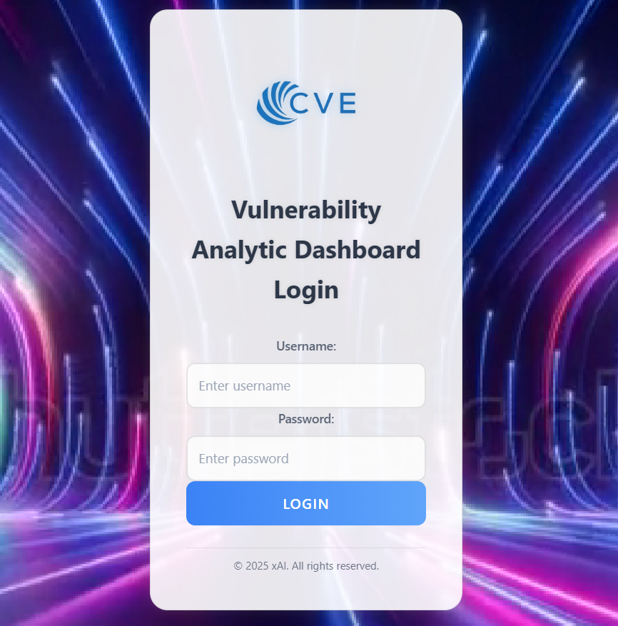
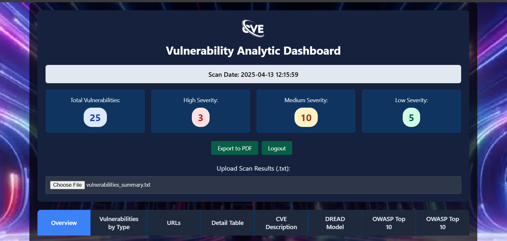
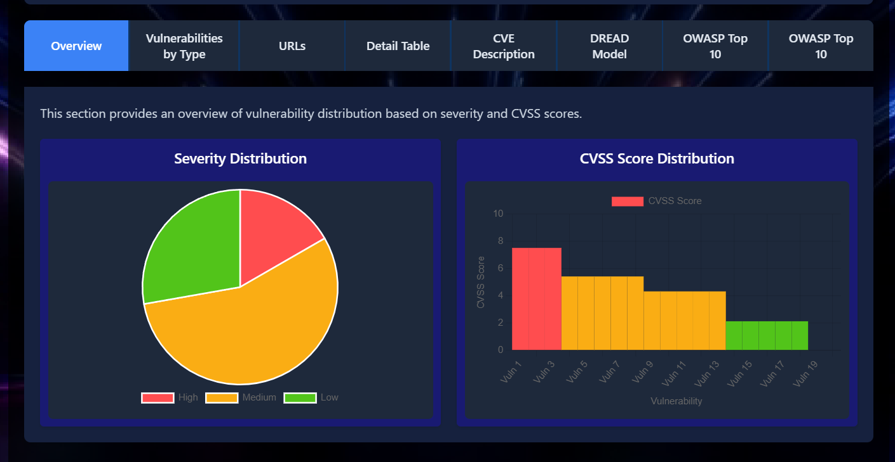

# Vulnerability Analytic Dashboard


A modern, responsive dashboard for visualizing website vulnerability scan results, integrated with CVE details from the NVD API, OWASP references, and DREAD risk assessment. The dashboard provides an interactive interface to analyze vulnerabilities, view charts and export reports.

[Live Demo](https://vedanshpundir.github.io/CVEAnalyticDashboard/)
# Instruction
To use the dashboard immediately without running the main code of CVEminor2.py you can use [vulnerability text file](vulnerabilities_summary.txt)

## Table of Contents
- [Overview](#overview)
- [Features](#features)
- [Technologies](#technologies)
- [Installation](#installation)
- [Usage](#usage)
- [Screenshots](#screenshots)
- [Contributing](#contributing)
- [Contact](#contact)

## Overview

This project is a **Website Vulnerability Analytic Dashboard** designed to help security professionals and developers identify, analyze, and mitigate vulnerabilities in web applications. It processes scan results, fetches CVE details using the NVD API, and provides actionable insights through interactive charts, tables, and OWASP references. The dashboard also includes a login system, export functionality for reports, and a DREAD-based risk assessment section.

The interface is built with a modern, dark-themed design, featuring a background video for an immersive experience. It is fully responsive and optimized for both desktop and mobile devices.

## Features

- **Interactive Dashboard**: Visualize vulnerability scan results with tabs for different views (e.g., vulnerabilities, charts, OWASP references, DREAD assessment).
- **NVD API Integration**: Fetches CVE details for identified vulnerabilities, including severity, CVSS scores, descriptions, and references.
- **Dynamic Charts**: Displays vulnerability statistics using charts (e.g., severity distribution, vulnerability types).
- **Tab Navigation**: Switch between sections like vulnerability tables, charts, OWASP references, and DREAD risk assessment.
- **Export Reports**: Export scan results as PDF or other formats with a single click.
- **OWASP References**: Provides OWASP Top 10 references for each vulnerability with clickable badges.
- **DREAD Risk Assessment**: Calculates risk scores using the DREAD model (Damage, Reproducibility, Exploitability, Affected Users, Discoverability).
- **Responsive Design**: Fully responsive layout with a mobile-friendly interface.
- **Login System**: Secure login page with a sleek design and background video.
- **Accordion Sections**: Expandable sections for detailed vulnerability information and mitigation steps.
- **File Upload**: Upload scan result files (e.g., JSON) for processing and visualization.

## Technologies

- **Frontend**:
  - HTML5, CSS3 (with responsive design)
  - JavaScript (for interactivity, charts, and tab navigation)
  - Chart.js (for rendering charts)
- **Backend** (assumed, adjust as needed):
  - Python (for vulnerability scanning and NVD API integration)
- **APIs**:
  - NVD API (for CVE details)
- **Styling**:
  - Custom CSS with a dark theme
- **Other**:
  - GitHub for version control
  - Markdown for documentation

## Installation

Follow these steps to set up the project locally:

### Prerequisites
- Python 3.8+
- Node.js (if using Chart.js or other JS dependencies)
- Git
- A valid NVD API key (sign up at [NVD](https://nvd.nist.gov/developers/request-an-api-key))

### Steps
1. **Clone the Repository**:
   ```bash
   git clone https://github.com/VedanshPundir/CVEAnalyticDashboard.git
   cd CVEAnalyticDashboard

## Usage

1. **Run the Application**:
   - Open the dashboard in your browser.
   - Alternatively, open `index.html` directly if using static files.

2. **Login**:
   - Navigate to the login page, enter your credentials, and access the dashboard.
   - Default credentials (update as needed):
     - Username: `admin`
     - Password: `password123`

3. **Upload Scan Results**:
   - Use the file upload section to upload a text file containing vulnerability scan results (e.g., `vulnerabilities_data.txt`).
  
## Screenshots
1. **Login Page**
   

2. **Dashboard**
   
   

   ## Contributing

Contributions are welcome! Follow these steps to contribute:

1. **Fork** the repository.

2. **Create a new branch**:
   ```bash
   git checkout -b feature/your-feature-name
## Contact

For questions, suggestions, or feedback, reach out to:

- 📧 **Email**: [vedanshpundir43@gmail.com](mailto:vedanshpundir43@gmail.com)
- 🧑‍💻 **GitHub**: [https://github.com/VedanshPundir](https://github.com/VedanshPundir)

## License

This project is licensed under the MIT License - see the [LICENSE](LICENSE) file for details.
  


